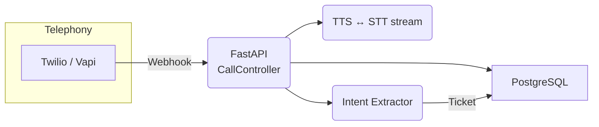

# PoC-1 — AI Voice Agent System

## 1. Overview
Automated voice assistant that places & receives calls, transcribes speech, extracts intent, and logs tickets.

## 2. Architecture

## 3. Setup

1. `cp .env.example .env` and fill in keys.
2. `docker compose up --build` or `make dev`.

## 4. API

| Method | Path                 | Description            |
| ------ | -------------------- | ---------------------- |
| POST   | `/call/outbound`     | Initiate outbound call |
| POST   | `/webhook/twilio`    | Handle inbound events  |
| GET    | `/conversation/{id}` | Retrieve transcript    |

## 5. Environment Variables (`.env.example`)

See file; includes `OPENAI_API_KEY`, `TWILIO_ACCOUNT_SID`, `TWILIO_AUTH_TOKEN`, `TWILIO_PHONE_NUMBER`, `POSTGRES_URL`, `ELEVENLABS_API_KEY`.

## 6. Testing

`pytest -q` runs unit tests (STT, intent).

## 7. License

MIT – see repository root.

