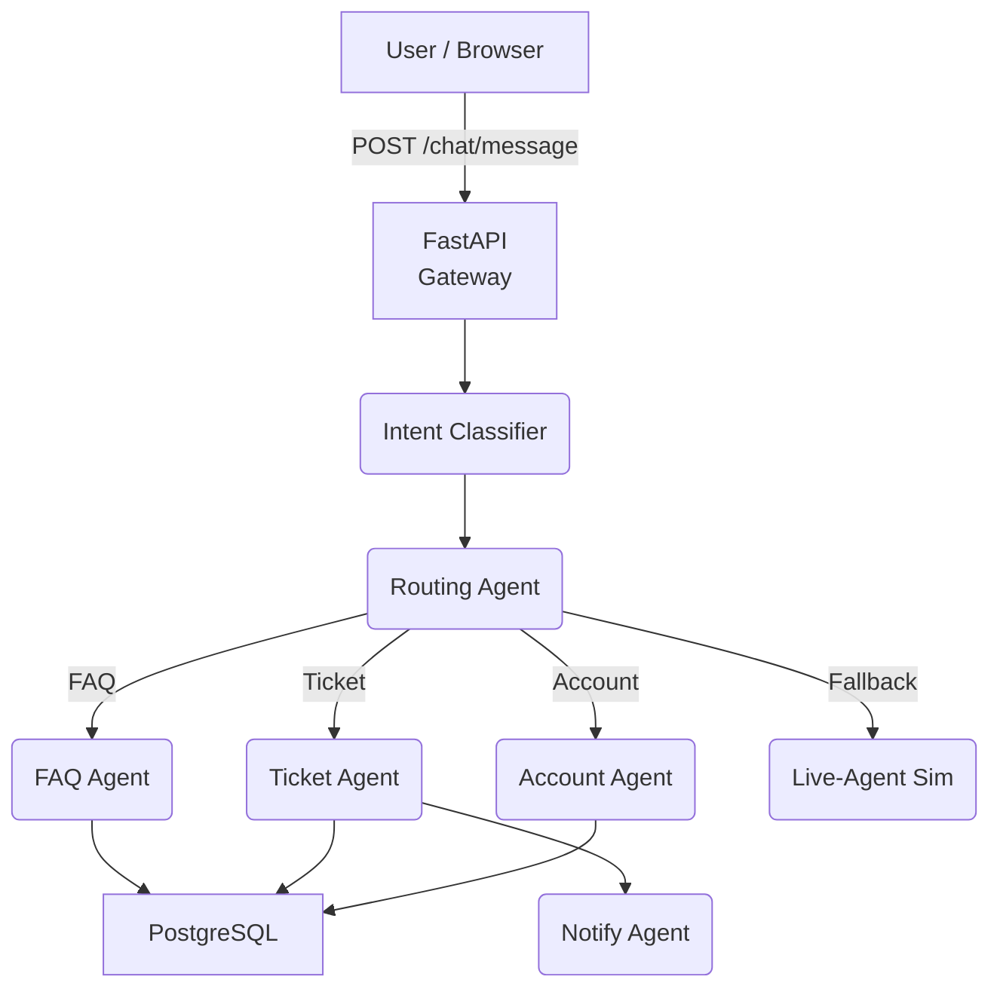

# PoC-2 — AI Multi-Agent Chat Support System

## 1. Overview
Chat platform that chains specialised AI agents (Intent, FAQ, Ticket, Account, Notify) to resolve support queries autonomously.

## 2. Architecture


## 3. Setup

```bash
cp .env.example .env
docker compose up --build
```

## 4. API

| Method | Path            | Purpose           |
| ------ | --------------- | ----------------- |
| POST   | `/chat/message` | Ingest chat       |
| GET    | `/session/{id}` | Full conversation |
| GET    | `/ticket/{id}`  | Ticket status     |

## 5. Environment Variables (`.env.example`)

Includes `OPENAI_API_KEY`, `POSTGRES_URL`, `SENDGRID_API_KEY`, `WHATSAPP_TOKEN`, `VECTOR_DB_PATH`.

## 6. Testing

`pytest -q` for agent unit tests.

## 7. License

MIT – see repository root.

